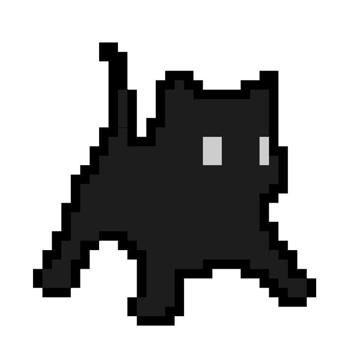

# Portfolio Cursor

Минималистичный сайт-портфолио с эффектом «жидкого стекла» и градиентным фоном.

## Запуск

Откройте `index.html` в браузере или запустите локальный сервер:

```powershell
cd C:\Users\Comp\portfolio-cursor
python -m http.server 8080
```

Затем откройте: http://localhost:8080

> Локальный сервер рекомендуется для корректной работы PDF и видео.

## Структура

```
portfolio-cursor/
├── index.html          — главная страница
├── css/styles.css      — стили (градиент, glassmorphism)
├── js/
│   ├── app.js          — навигация, плеер, просмотр PDF
│   └── data.js         — список работ (редактируйте здесь)
└── assets/
    ├── portrait/       — ваш портрет
    ├── magazines/      — PDF-журналы
    ├── videos/         — видеофайлы (.mp4)
    └── works/          — векторные и растровые работы
```

## Как добавить свои материалы

### Портрет
В `index.html` замените блок `.portrait-placeholder` на:

```html
<div class="portrait-placeholder">
  
</div>
```

### Журналы (PDF)
1. Положите PDF в `assets/magazines/`
2. Добавьте запись в `js/data.js` → `magazines.items`

### Видео
1. Положите `.mp4` в `assets/videos/`
2. Обновите `file` в `js/data.js` → `videos.items`

### Работы (вектор / растр)
1. Положите файлы в `assets/works/` (.svg, .png, .jpg, .webp)
2. Добавьте записи в `js/data.js` → `works.items`

## Страницы

1. **Welcome** — портрет + кнопка «Далее»
2. **Категории** — журналы, видео, работы
3. **Галерея** — список работ в категории
4. **Модальные окна** — видеоплеер, PDF-просмотр, просмотр изображений
